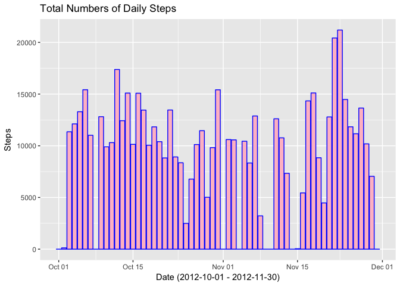
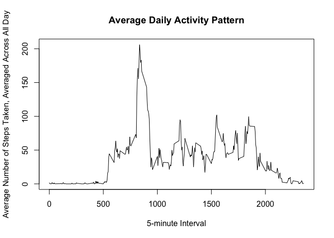
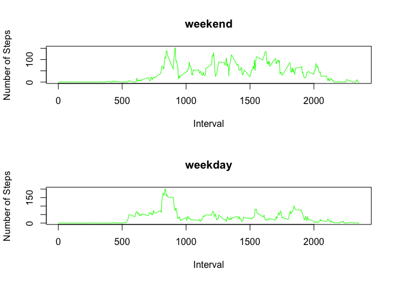

# Reproducible Research: Peer Assessment 1

## Loading and preprocessing the data.

```r
unzip("activity.zip", exdir = ".")
activity <- read.csv("activity.csv", header = TRUE)
```

## What is mean total number of steps taken per day?
##### 1. Calculating the total number of steps taken per day.

```r
# please install/load dplyr package
library(dplyr, warn.conflicts = FALSE)
activity$date <- as.Date(as.character(activity$date), "%Y-%m-%d")
# calculating the total number of steps taken per day
stepsSum <- as.data.frame(select(activity, steps, date) %>% group_by(date) %>% summarize(steps = sum(steps, na.rm = TRUE)))
```

##### 2. Making a histogram of the total number of steps taken each day.


```r
library(ggplot2)
g <- ggplot(stepsSum)
g + aes(x = date, y = steps) + geom_histogram(stat = "identity", fill = "pink", col = "blue") + labs(title = "Total Numbers of Daily Steps", x = "Date (2012-10-01 - 2012-11-30)", y = "Steps")
```

```
## Warning: Ignoring unknown parameters: binwidth, bins, pad
```

<!-- -->

##### 3. Calculating and reporting the mean and median of the total number of steps taken per day.


```r
dailyMeanMedian <- as.data.frame(select(activity, date, steps) %>% group_by(date) %>% summarize(Mean = round(mean(steps, na.rm = TRUE),2), Median = median(steps, na.rm = TRUE)))
dailyMeanMedian
```

```
##          date  Mean Median
## 1  2012-10-01   NaN     NA
## 2  2012-10-02  0.44      0
## 3  2012-10-03 39.42      0
## 4  2012-10-04 42.07      0
## 5  2012-10-05 46.16      0
## 6  2012-10-06 53.54      0
## 7  2012-10-07 38.25      0
## 8  2012-10-08   NaN     NA
## 9  2012-10-09 44.48      0
## 10 2012-10-10 34.38      0
## 11 2012-10-11 35.78      0
## 12 2012-10-12 60.35      0
## 13 2012-10-13 43.15      0
## 14 2012-10-14 52.42      0
## 15 2012-10-15 35.20      0
## 16 2012-10-16 52.38      0
## 17 2012-10-17 46.71      0
## 18 2012-10-18 34.92      0
## 19 2012-10-19 41.07      0
## 20 2012-10-20 36.09      0
## 21 2012-10-21 30.63      0
## 22 2012-10-22 46.74      0
## 23 2012-10-23 30.97      0
## 24 2012-10-24 29.01      0
## 25 2012-10-25  8.65      0
## 26 2012-10-26 23.53      0
## 27 2012-10-27 35.14      0
## 28 2012-10-28 39.78      0
## 29 2012-10-29 17.42      0
## 30 2012-10-30 34.09      0
## 31 2012-10-31 53.52      0
## 32 2012-11-01   NaN     NA
## 33 2012-11-02 36.81      0
## 34 2012-11-03 36.70      0
## 35 2012-11-04   NaN     NA
## 36 2012-11-05 36.25      0
## 37 2012-11-06 28.94      0
## 38 2012-11-07 44.73      0
## 39 2012-11-08 11.18      0
## 40 2012-11-09   NaN     NA
## 41 2012-11-10   NaN     NA
## 42 2012-11-11 43.78      0
## 43 2012-11-12 37.38      0
## 44 2012-11-13 25.47      0
## 45 2012-11-14   NaN     NA
## 46 2012-11-15  0.14      0
## 47 2012-11-16 18.89      0
## 48 2012-11-17 49.79      0
## 49 2012-11-18 52.47      0
## 50 2012-11-19 30.70      0
## 51 2012-11-20 15.53      0
## 52 2012-11-21 44.40      0
## 53 2012-11-22 70.93      0
## 54 2012-11-23 73.59      0
## 55 2012-11-24 50.27      0
## 56 2012-11-25 41.09      0
## 57 2012-11-26 38.76      0
## 58 2012-11-27 47.38      0
## 59 2012-11-28 35.36      0
## 60 2012-11-29 24.47      0
## 61 2012-11-30   NaN     NA
```

## What is the average daily activity pattern?
##### 1. Make a time series plot (i.e. 𝚝𝚢𝚙𝚎 = "𝚕") of the 5-minute interval (x-axis) and the average number of steps taken, averaged across all days (y-axis).

```r
intervalDailyAverage <- as.data.frame(select(activity, steps, date, interval) %>% group_by(interval) %>% summarize(IntervalAverage = round(mean(steps,na.rm = TRUE),2)))
# building the plot
plot(intervalDailyAverage$interval, intervalDailyAverage$IntervalAverage, xlab ="5-minute Interval", ylab = "Average Number of Steps Taken, Averaged Across All Day", main = "Average Daily Activity Pattern", type = "l")
```

<!-- -->

##### 2.Which 5-minute interval, on average across all the days in the dataset, contains the maximum number of steps?


```r
max(intervalDailyAverage$IntervalAverage)
```

```
## [1] 206.17
```

## Imputing missing values
##### 1.Calculate and report the total numbers of missing values in the dataset(i.e. the total number of rows with NAs).

```r
natable <- table(is.na(activity))
totalMissingValues <- natable[2]
totalMissingValues
```

```
## TRUE 
## 2304
```

##### 2.Devise a strategy for filling in all of the missing values in the dataset.


```r
# my strategy is using the mean of each day, as a replacement for the group-matching NA values
splitStepsDate <- split(activity$steps, activity$date)
meanStepsDate <- lapply(splitStepsDate, mean, na.rm = TRUE)
```

##### 3.Create a new dataset that is equal to the original dataset but with the missing data filled in.


```r
newActivity <- activity
newMeanStepsDate <- rep(meanStepsDate, lapply(splitStepsDate, function(x) sum(is.na(x))))
newActivity[is.na(newActivity)] <- newMeanStepsDate
newActivity[is.na(newActivity)] <- 0
```

##### 4.Make a histogram of the total number of steps taken each day and Calculate and report the mean and median total number of steps taken per day. Do these values differ from the estimates from the first part of the assignment? What is the impact of imputing missing data on the estimates of the total daily number of steps?


```r
newActivty <- as.data.frame(newActivity)
newActivity$date <- as.Date(as.character(newActivity$date), "%Y-%m-%d")
newActivity$steps<- as.integer(newActivity$steps)
# calculating the total number of steps taken each day
newStepsSum <- as.data.frame(select(newActivity, steps, date) %>% group_by(date) %>% summarize(steps = sum(steps)))
# making a histogram of the total number of steps taken each day
newG <- ggplot(newStepsSum)
newG + aes(x = date, y = steps) + geom_histogram(stat = "identity", fill = "pink", col = "blue") + labs(title = "Total Numbers of Daily Steps", x = "Date (2012-10-01 - 2012-11-30)", y = "Steps")
```

```
## Warning: Ignoring unknown parameters: binwidth, bins, pad
```

<!-- -->

```r
# calculating and reporting the mean and meadian total number of steps taken per day
newDailyMeanMedian <- as.data.frame(select(newActivity, date, steps) %>% group_by(date) %>% summarize(Mean = round(mean(steps),2), Median = median(steps)))
newDailyMeanMedian
```

```
##          date  Mean Median
## 1  2012-10-01  0.00      0
## 2  2012-10-02  0.44      0
## 3  2012-10-03 39.42      0
## 4  2012-10-04 42.07      0
## 5  2012-10-05 46.16      0
## 6  2012-10-06 53.54      0
## 7  2012-10-07 38.25      0
## 8  2012-10-08  0.00      0
## 9  2012-10-09 44.48      0
## 10 2012-10-10 34.38      0
## 11 2012-10-11 35.78      0
## 12 2012-10-12 60.35      0
## 13 2012-10-13 43.15      0
## 14 2012-10-14 52.42      0
## 15 2012-10-15 35.20      0
## 16 2012-10-16 52.38      0
## 17 2012-10-17 46.71      0
## 18 2012-10-18 34.92      0
## 19 2012-10-19 41.07      0
## 20 2012-10-20 36.09      0
## 21 2012-10-21 30.63      0
## 22 2012-10-22 46.74      0
## 23 2012-10-23 30.97      0
## 24 2012-10-24 29.01      0
## 25 2012-10-25  8.65      0
## 26 2012-10-26 23.53      0
## 27 2012-10-27 35.14      0
## 28 2012-10-28 39.78      0
## 29 2012-10-29 17.42      0
## 30 2012-10-30 34.09      0
## 31 2012-10-31 53.52      0
## 32 2012-11-01  0.00      0
## 33 2012-11-02 36.81      0
## 34 2012-11-03 36.70      0
## 35 2012-11-04  0.00      0
## 36 2012-11-05 36.25      0
## 37 2012-11-06 28.94      0
## 38 2012-11-07 44.73      0
## 39 2012-11-08 11.18      0
## 40 2012-11-09  0.00      0
## 41 2012-11-10  0.00      0
## 42 2012-11-11 43.78      0
## 43 2012-11-12 37.38      0
## 44 2012-11-13 25.47      0
## 45 2012-11-14  0.00      0
## 46 2012-11-15  0.14      0
## 47 2012-11-16 18.89      0
## 48 2012-11-17 49.79      0
## 49 2012-11-18 52.47      0
## 50 2012-11-19 30.70      0
## 51 2012-11-20 15.53      0
## 52 2012-11-21 44.40      0
## 53 2012-11-22 70.93      0
## 54 2012-11-23 73.59      0
## 55 2012-11-24 50.27      0
## 56 2012-11-25 41.09      0
## 57 2012-11-26 38.76      0
## 58 2012-11-27 47.38      0
## 59 2012-11-28 35.36      0
## 60 2012-11-29 24.47      0
## 61 2012-11-30  0.00      0
```

```r
# all the NA values were clustered in entire steps rows for 8 different days. The estimate are only differs for one having NAs and the other one, instead having 0s. Just NA values have changed to 0s for this example 
```

## Are there differences in activity patterns between weekdays and weekends?
##### 1.Create a new factor variable in the dataset with two levels – “weekday” and “weekend” indicating whether a given date is a weekday or weekend day.


```r
newActivity <- mutate(newActivity, Weekdays = factor(weekdays(date)))
levels(newActivity$Weekdays)[levels(newActivity$Weekdays) == "Monday"] <- "weekday"
levels(newActivity$Weekdays)[levels(newActivity$Weekdays) == "Tuesday"] <- "weekday"
levels(newActivity$Weekdays)[levels(newActivity$Weekdays) == "Wednesday"] <- "weekday"
levels(newActivity$Weekdays)[levels(newActivity$Weekdays) == "Thursday"] <- "weekday"
levels(newActivity$Weekdays)[levels(newActivity$Weekdays) == "Friday"] <- "weekday"
levels(newActivity$Weekdays)[levels(newActivity$Weekdays) == "Saturday"] <- "weekend"
levels(newActivity$Weekdays)[levels(newActivity$Weekdays) == "Sunday"] <- "weekend"
```

##### 2.Make a panel plot containing a time series plot (i.e. 𝚝𝚢𝚙𝚎 = "𝚕") of the 5-minute interval (x-axis) and the average number of steps taken, averaged across all weekday days or weekend days (y-axis).


```r
weekendDailyAverage <- as.data.frame(select(newActivity, steps, date, interval, Weekdays) %>% filter(Weekdays == "weekend") %>% group_by(interval) %>% summarize(IntervalAverage = round(mean(steps),2)))
weekdayDailyAverage <- as.data.frame(select(newActivity, steps, date, interval, Weekdays) %>% filter(Weekdays == "weekday") %>% group_by(interval) %>% summarize(IntervalAverage = round(mean(steps),2)))
# building the plot
par(mfrow=c(2,1))
plot(weekendDailyAverage$interval, weekendDailyAverage$IntervalAverage, xlab ="Interval", ylab = "Number of Steps", main = "weekend", type = "l", col = "green")
plot(weekdayDailyAverage$interval, weekdayDailyAverage$IntervalAverage, xlab ="Interval", ylab = "Number of Steps", main = "weekday", type = "l", col = "green")
```

<!-- -->
